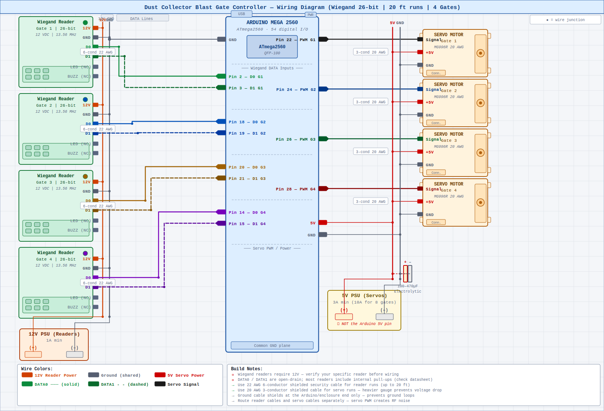

# Automated Dust Collector Blast Gate Controller

A workshop automation system that uses Wiegand RFID readers and servo motors to open and close dust collector blast gates — one gate at a time — from any machine in the shop. Designed for cable runs up to 20 feet.

---

## Repository Structure

```
dust-collector-gate-controller/
├── README.md                          ← You are here
├── wiring-diagram.svg                 ← Full color-coded wiring diagram
└── code/
    ├── BlastGateController/
    │   ├── BlastGateController.ino    ← Main sketch
    │   └── config.h                  ← All user-configurable settings
    └── Calibration/
        └── Calibration.ino           ← Servo angle calibration tool
```

---

## Table of Contents

1. [System Overview](#system-overview)
2. [Why Wiegand Instead of SPI Readers](#why-wiegand-instead-of-spi-readers)
3. [Features](#features)
4. [Hardware Requirements](#hardware-requirements)
5. [Cable Selection](#cable-selection)
6. [Wiring Diagram](#wiring-diagram)
7. [Wiring & Pinout](#wiring--pinout)
8. [Software Setup](#software-setup)
9. [Code Files](#code-files)
10. [Configuration Reference](#configuration-reference)
11. [Calibrating the Servo Angles](#calibrating-the-servo-angles)
12. [Assembly Guide](#assembly-guide)
13. [Expanding to 8 Gates](#expanding-to-8-gates)
14. [Lessons Learned from Testing](#lessons-learned-from-testing)
15. [Troubleshooting](#troubleshooting)
16. [Bill of Materials](#bill-of-materials)

---

## System Overview

```
 MACHINE 1          MACHINE 2          MACHINE 3          MACHINE 4
┌──────────┐       ┌──────────┐       ┌──────────┐       ┌──────────┐
│ Wiegand  │       │ Wiegand  │       │ Wiegand  │       │ Wiegand  │
│  Reader  │       │  Reader  │       │  Reader  │       │  Reader  │
└────┬─────┘       └────┬─────┘       └────┬─────┘       └────┬─────┘
     │ 4 wires          │ 4 wires          │ 4 wires          │ 4 wires
     │ (up to 20 ft)    │                  │                  │
     └──────────────────┴──────────────────┴──────────────────┘
                                 │
                         ┌───────▼────────┐
                         │  Arduino Mega  │
                         │  (Controller)  │
                         └───────┬────────┘
                                 │
     ┌───────────────────────────┼───────────────────────────┐
┌────▼─────┐          ┌────▼─────┐          ┌────▼─────┐          ┌────▼─────┐
│  Servo   │          │  Servo   │          │  Servo   │          │  Servo   │
│  Gate 1  │          │  Gate 2  │          │  Gate 3  │          │  Gate 4  │
└──────────┘          └──────────┘          └──────────┘          └──────────┘
```

**How it works:**

1. Walk up to a machine and scan your RFID card at that machine's reader.
2. The controller checks whether that gate is currently open or closed.
   - **If closed:** All other open gates are closed first, then this gate opens.
   - **If open:** This gate closes.
3. Only one gate is ever open at a time, ensuring full suction at the active machine.

---

## Why Wiegand Instead of SPI Readers

The original design used MFRC522 modules communicating over SPI. SPI works on a bench or PCB but is not suited to a shop environment with 20-foot cable runs:

| Factor | SPI (MFRC522) | Wiegand 26-bit |
|---|---|---|
| Max reliable cable run | ~3 feet | 50+ feet |
| Signal wires per reader | 6 (MOSI, MISO, SCK, SS, RST, 3.3V) | 2 (DATA0, DATA1) |
| Noise immunity | Poor — high-speed shared bus | Excellent — slow open-drain pulses |
| Protocol error correction | None | Parity bits on each frame |
| Reader cost | ~$3 module | ~$12 enclosed reader |
| Physical form | Bare PCB module | Enclosed housing — shop appropriate |

Wiegand is the protocol used in commercial building access control systems — designed exactly for this use case: long cable runs from readers back to a central controller, in electrically noisy environments.

---

## Features

- ✅ Toggle any blast gate open/closed with an RFID card tap
- ✅ Enforces single-gate-open policy automatically
- ✅ Wiegand 26-bit protocol — reliable at 20-foot cable runs (and well beyond)
- ✅ Only 4 active wires per reader run (12V, GND, DATA0, DATA1)
- ✅ Supports 4 gates out of the box; expandable to 8
- ✅ Handles streaming readers that output data continuously while card is in field
- ✅ Scan debounce prevents accidental double-triggers
- ✅ Serial monitor output for debugging and gate status
- ✅ All gates default to closed on power-up

---

## Hardware Requirements

| Component | Quantity (4 gates) | Notes |
|---|---|---|
| Arduino Mega 2560 | 1 | Pin count needed for 8-gate expansion |
| Wiegand 26-bit RFID Reader | 4 | 12VDC — see reader selection notes below |
| RFID Cards or Key Fobs | 4+ | Must match reader frequency — see below |
| Servo Motor (MG996R or equivalent) | 4 | MG996R recommended for torque |
| 12V DC Power Supply | 1 | 1A min — powers all RFID readers |
| 5V DC Power Supply | 1 | 3A min — powers all servo motors |
| Capacitor 100–470µF electrolytic | 1 | Across 5V/GND near servo power rail |
| 6-conductor 22 AWG shielded cable | 4 runs | One per RFID reader run (up to 20 ft each) |
| 3-conductor 20 AWG shielded cable | 4 runs | One per servo run (up to 20 ft each) |
| Terminal block strip | 1–2 | Inside the enclosure for all cable terminations |
| Project enclosure box | 1 | Mounts the Arduino and terminal blocks |
| Jumper wires | assorted | Short connections inside the enclosure |

### Selecting a Wiegand Reader

This is the most important purchasing decision in the build. There are several ways to get it wrong — all learned from direct testing.

**Reader variant — ID vs IC**

Many Wiegand readers are sold in two nearly identical variants that look the same but read completely different card types. Check the label on the back of the reader for a checkbox or indicator:

| Label | Frequency | Compatible Cards |
|---|---|---|
| **ID** or **EM** | 125 kHz | EM4100, TK4100 key fobs |
| **IC** or **MF** or **Mifare** | 13.56 MHz | Mifare Classic 1K (S50) |

Buying the wrong variant is the single most common mistake. The reader will power up, beep, and light its LED normally — but will never read cards of the wrong frequency.

**Recommended card type: Mifare Classic 1K (13.56 MHz)**

For this project, the **IC/Mifare variant** reader paired with **Mifare Classic 1K cards** (also labeled S50) is the recommended combination. These are the white credit-card style or key-fob cards commonly bundled with access control kits on Amazon.

Cards to avoid even though they are also 13.56 MHz:
- NTAG213, NTAG215, NTAG216 — NFC Forum tags designed for phones, not access control readers
- Mifare Ultralight, DESFire — different sub-protocols, not supported by most Wiegand readers

**Gray wire (WG26 / WG34 selection)**

Most readers in this price range have a gray wire that selects between Wiegand 26-bit and Wiegand 34-bit output. The sketch uses Wiegand 26-bit. The gray wire behavior varies by manufacturer — check the label on your specific reader:

- **Most common:** gray wire unconnected = WG26, gray wire to GND = WG34
- **Some readers (including some LBS models):** gray wire to GND = WG26, unconnected = WG34

Verify this on your reader's label before wiring. Using WG34 mode will cause the sketch to receive 34-bit frames which won't decode correctly.

**Recommended reader: YARONGTECH Waterproof 13.56MHz Wiegand 26**

Search Amazon for "YARONGTECH Waterproof 13.56MHz Wiegand 26" (ASIN B01DAH94RE). This reader is confirmed to work with Mifare Classic 1K cards, ships with 2 cards included, has clearly documented gray wire behavior, and is IP68 waterproof.

**Other specifications to look for:**
- Supply voltage: 12VDC (some accept 9–14V)
- DATA output: 5V-compatible open-drain (standard on virtually all Wiegand readers)
- Housing: enclosed with mounting holes — avoid bare PCB modules for shop use

> **Pull-up note:** DATA0 and DATA1 are open-drain outputs. Most enclosed readers include internal 5V pull-up resistors. If your reader does not, add 1 kΩ pull-up resistors from DATA0 and DATA1 to the Arduino 5V rail.

---

## Cable Selection

### RFID Reader Runs (up to 20 ft per machine)

Use **22 AWG 6-conductor foil-shielded cable** — the same type used to wire commercial access control door readers.

| Cable | AWG | Notes |
|---|---|---|
| Belden 5400UE or equivalent | 22 AWG | Purpose-made access control cable — ideal |
| Alpha Wire 2466C or equivalent | 22 AWG | Good alternative |
| Generic shielded security/alarm cable | 22–24 AWG | Available at Home Depot, Lowe's, electrical supply |

You use 4 of the 6 conductors (12V, GND, DATA0, DATA1). The spare two can be left unterminated or saved as spares.

**Standard Wiegand wire color conventions:**

| Wire Color | Signal |
|---|---|
| Red | 12V Power |
| Black | GND |
| Green | DATA0 |
| White | DATA1 |
| Orange | LED control (not connected) |
| Blue/Brown | Beeper (not connected) |
| Gray | WG26/WG34 select — see reader notes above |

### Servo Motor Runs (up to 20 ft per gate)

Use **20 AWG 3-conductor foil-shielded cable.** The heavier 20 AWG gauge is important for the power conductors — at 20 feet, 22 AWG adds enough resistance to cause measurable voltage drop under servo load.

| Wire Color | Signal |
|---|---|
| Red | +5V Power |
| Black | GND |
| Yellow or White | PWM Signal |

### Cable Best Practices

- **Ground shields at the Arduino/enclosure end only.** Grounding both ends creates a ground loop. Connect the drain wire to the enclosure GND terminal and leave it floating at the machine end.
- **Route reader cables and servo cables in separate conduit.** Servo PWM switching generates RF noise that can cause spurious Wiegand reads.
- **Keep reader cables away from 120V AC wiring.** Cross AC lines at 90° if you must; never run parallel to them.
- **Label every cable at both ends** before routing through conduit — use machine names, not numbers.
- Use **terminal blocks inside the enclosure** rather than soldering directly to Arduino headers.
- Running cables along grounded metal ductwork is acceptable and the metal acts as additional shielding. Keep reader and servo cables on opposite sides of the duct.

---

## Wiring Diagram

See [`wiring-diagram.svg`](wiring-diagram.svg) for the full color-coded diagram showing all components, wire routes, and pin assignments.

[](wiring-diagram.svg)

---

## Wiring & Pinout

### Reader DATA Pins (Wiegand)

Each reader connects to its own dedicated DATA0 and DATA1 pin. There is no shared bus — each reader is fully independent.

Gates 1–3 use **hardware interrupt pins** on the Mega (INT0–INT5). Gates 4–8 use **pin-change interrupts**. The sketch automatically selects the correct interrupt method per pin — do not swap hardware interrupt pins for non-interrupt pins on gates 1–3 or the sketch will silently fail to read cards.

| Gate | DATA0 Pin | DATA1 Pin | Interrupt Type |
|---|---|---|---|
| Gate 1 | Pin 2  | Pin 3  | Hardware INT4 / INT5 |
| Gate 2 | Pin 18 | Pin 19 | Hardware INT3 / INT2 |
| Gate 3 | Pin 20 | Pin 21 | Hardware INT1 / INT0 |
| Gate 4 | Pin 14 | Pin 15 | Pin-change (PCINT) |
| Gate 5 (expansion) | Pin 4  | Pin 5  | Pin-change |
| Gate 6 (expansion) | Pin 6  | Pin 7  | Pin-change |
| Gate 7 (expansion) | Pin 8  | Pin 9  | Pin-change |
| Gate 8 (expansion) | Pin 10 | Pin 11 | Pin-change |

> ⚠️ **Do not use `attachPCINT()` on hardware interrupt pins** (2, 3, 18, 19, 20, 21). It silently fails on those pins. The sketch handles this automatically — do not change the interrupt attachment logic in `BlastGateController.ino`.

### Reader Power Connections

All readers share a single 12V supply. The 12V PSU (–) **must** be tied to Arduino GND.

| Reader Wire | Connect To |
|---|---|
| Red (12V) | 12V PSU (+) terminal bus |
| Black (GND) | Common GND terminal bus |
| Green (DATA0) | Arduino DATA0 pin (per gate table above) |
| White (DATA1) | Arduino DATA1 pin (per gate table above) |
| Gray (WG26/34) | See reader label — set for WG26 output |
| Orange (LED) | Not connected |
| Blue/Brown (Beeper) | Not connected |

### Servo Connections

| Arduino Mega Pin | Connected To |
|---|---|
| Pin 22 | Servo Gate 1 signal |
| Pin 24 | Servo Gate 2 signal |
| Pin 26 | Servo Gate 3 signal |
| Pin 28 | Servo Gate 4 signal |
| Pin 30 | Servo Gate 5 (expansion) |
| Pin 32 | Servo Gate 6 (expansion) |
| Pin 34 | Servo Gate 7 (expansion) |
| Pin 36 | Servo Gate 8 (expansion) |

### Power Distribution

```
12V PSU (+) ─────────── 12V reader power bus
                          ├── Reader 1 Red
                          ├── Reader 2 Red
                          ├── Reader 3 Red
                          └── Reader 4 Red

5V PSU (+) ──────────── 5V servo power bus
                          ├── Servo 1 Red
                          ├── Servo 2 Red
                          ├── Servo 3 Red
                          ├── Servo 4 Red
                          ├── [+] 100–470µF Cap
                          └── Arduino Mega 5V pin

Common GND ──────────── GND bus  ← ALL THREE MUST BE TIED TOGETHER
                          ├── 12V PSU (–)
                          ├── 5V PSU (–)
                          ├── Arduino GND
                          ├── All reader GND Black
                          ├── All servo GND Black/Brown
                          └── [–] 100–470µF Cap
```

> ⚠️ **All three grounds must be tied together** — 12V PSU (–), 5V PSU (–), and Arduino GND. This is the single most common wiring mistake. Without a common ground, Wiegand DATA lines have no reference and produce phantom reads or no reads at all. A loose ground connection causes the same symptoms.

> ⚠️ **Do not power servos from the Arduino's 5V pin.** The Arduino's onboard regulator cannot supply enough current — servos will jitter continuously even without any commands. Use the dedicated external 5V PSU only.

---

## Software Setup

### 1. Install Arduino IDE

Download and install the [Arduino IDE](https://www.arduino.cc/en/software) (version 2.x recommended).

### 2. Install Required Libraries

In the Arduino IDE, go to **Tools → Manage Libraries** and install:

| Library | Author | Purpose |
|---|---|---|
| `PinChangeInterrupt` | NicoHood | Pin-change interrupts for gate 4+ expansion pins |
| `Servo` | Arduino | Built-in — controls servo motors |

Or via Arduino CLI:

```bash
arduino-cli lib install "PinChangeInterrupt"
```

### 3. Select Board

- Go to **Tools → Board → Arduino AVR Boards → Arduino Mega or Mega 2560**
- Go to **Tools → Port** and select the COM port for your Mega

### 4. Configure and Upload

1. Open [`code/BlastGateController/config.h`](code/BlastGateController/config.h)
2. Set `NUM_GATES` to the number of gates you have wired
3. Adjust servo angles if needed (see [Calibration](#calibrating-the-servo-angles))
4. Open [`code/BlastGateController/BlastGateController.ino`](code/BlastGateController/BlastGateController.ino) in the Arduino IDE
5. Click **Upload**
6. Open **Serial Monitor** at 9600 baud — the startup output confirms which interrupt type each gate is using

---

## Code Files

| File | Description |
|---|---|
| [`code/BlastGateController/BlastGateController.ino`](code/BlastGateController/BlastGateController.ino) | Main sketch — Wiegand ISR handling, automatic HW/PCINT interrupt selection, gate toggle logic, servo control, serial logging |
| [`code/BlastGateController/config.h`](code/BlastGateController/config.h) | All user-configurable settings: gate count, D0/D1 pins, servo angles, debounce timing |
| [`code/Calibration/Calibration.ino`](code/Calibration/Calibration.ino) | Standalone servo calibration tool — send angles over Serial Monitor to find open/close positions |

---

## Configuration Reference

All settings live in [`code/BlastGateController/config.h`](code/BlastGateController/config.h). You should not need to edit `BlastGateController.ino` for a standard build.

| Constant | Default | Description |
|---|---|---|
| `NUM_GATES` | `4` | Number of active gates (max 8) |
| `SERVO_OPEN_ANGLE` | `90` | Servo degrees when gate is fully open |
| `SERVO_CLOSED_ANGLE` | `0` | Servo degrees when gate is fully closed |
| `SERVO_MOVE_DELAY` | `500` | ms to wait after commanding a servo move |
| `SCAN_DEBOUNCE_MS` | `2000` | Minimum ms between triggers on the same reader |
| `D0_PINS[]` | `{2,18,20,14,...}` | DATA0 pin per reader |
| `D1_PINS[]` | `{3,19,21,15,...}` | DATA1 pin per reader |
| `SERVO_PINS[]` | `{22,24,26,28,...}` | Servo signal pin per gate |

---

## Calibrating the Servo Angles

Blast gate linkages vary by installation. Tune `SERVO_OPEN_ANGLE` and `SERVO_CLOSED_ANGLE` before final installation using the dedicated calibration sketch.

Use [`code/Calibration/Calibration.ino`](code/Calibration/Calibration.ino):

1. Change `SERVO_PIN` at the top of the sketch to the gate you're testing.
2. Upload the sketch.
3. Open **Serial Monitor** at 9600 baud.
4. **Important:** Set the line ending dropdown in the Serial Monitor to **Newline** (bottom-right of the Serial Monitor window). Without this, `parseInt()` never receives a terminator and the servo won't respond.
5. Type angles (0–180) and press Enter — the servo moves immediately.
6. Record the fully-open and fully-closed positions.
7. Enter those values in `config.h` as `SERVO_OPEN_ANGLE` and `SERVO_CLOSED_ANGLE`.
8. Repeat for each gate if linkage geometry differs.

> **If the servo doesn't respond at all:** Check that the servo is powered from the **external 5V PSU**, not the Arduino 5V pin. A servo on Arduino power will jitter but not respond to commands reliably.

> **Tip:** If individual gates need different angles, change the constants in `config.h` from single values to arrays:
> ```cpp
> const int SERVO_OPEN_ANGLE[8]   = {90, 85, 95, 90, 90, 90, 90, 90};
> const int SERVO_CLOSED_ANGLE[8] = { 0,  5,  0,  0,  0,  0,  0,  0};
> ```
> Then update `BlastGateController.ino` to index by gate when calling `servo.write()`.

---

## Assembly Guide

### Step 1 — Mount the Enclosure

Choose a central location close to the dust collector. All reader and servo cables terminate here. Proximity to the dust collector minimizes servo cable runs.

### Step 2 — Plan and Label Cable Routes

Before cutting any cable:

1. Measure the actual route (around corners, not straight-line) from each machine to the enclosure.
2. Add 10–15% slack for routing and future service.
3. Plan reader cables and servo cables in completely separate runs.

### Step 3 — Run RFID Reader Cables

For each machine:

1. Cut a run of **22 AWG 6-conductor shielded cable.**
2. Label both ends with the machine name before routing.
3. Terminate at the reader: Red=12V, Black=GND, Green=D0, White=D1, Gray=WG26 config.
4. Terminate at the enclosure on the terminal block.
5. Connect the shield drain wire to GND at the enclosure end only — leave floating at the reader.

### Step 4 — Run Servo Cables

For each blast gate:

1. Cut a run of **20 AWG 3-conductor shielded cable.**
2. Label both ends.
3. Terminate at the servo: Red=+5V, Black=GND, Yellow/White=Signal.
4. Terminate at the enclosure terminal block.
5. Ground shield at the enclosure end only.

### Step 5 — Mount and Link the Servo Motors

1. Fabricate or 3D print a servo bracket alongside each gate slider.
2. Attach a servo arm or pushrod to the gate slide.
3. Do **not** fully tighten the linkage until after angle calibration.

### Step 6 — Install the Arduino and Power Supplies

1. Mount the Arduino Mega on standoffs inside the enclosure.
2. Install terminal block strips for power distribution.
3. Wire 12V PSU (+) to the 12V reader bus.
4. Wire 5V PSU (+) to the 5V servo bus.
5. **Tie all grounds together at one terminal block:** 12V PSU (–), 5V PSU (–), and Arduino GND. Use a short jumper wire between each — verify each connection is secure. A loose ground here is the most common cause of phantom reads and missed reads.
6. Wire D0 and D1 from each reader terminal to Arduino pins per the pinout table.
7. Wire servo signal wires to Arduino SERVO_PINS.
8. Wire servo power (Red) to the 5V bus; servo GND to the common GND bus.
9. Install a 100–470µF electrolytic capacitor across the 5V servo bus and GND.

### Step 7 — Verify Startup Output

Before testing cards or servos:

1. Connect Arduino Mega to computer via USB.
2. Open `BlastGateController.ino` and upload.
3. Open **Serial Monitor** at 9600 baud.
4. Confirm the startup output lists each gate with its pin numbers and interrupt type:

```
Gate 1: D0=pin 2  D1=pin 3  [HW interrupt]
Gate 2: D0=pin 18  D1=pin 19  [HW interrupt]
Gate 3: D0=pin 20  D1=pin 21  [HW interrupt]
Gate 4: D0=pin 14  D1=pin 15  [PCINT]
```

If a gate shows `[PCINT]` when it should show `[HW interrupt]`, the D0/D1 pins for that gate are wired to the wrong Arduino pins.

### Step 8 — Calibrate Servo Angles

Follow the [Calibration section](#calibrating-the-servo-angles) and update `config.h`.

### Step 9 — Full System Test

1. Scan a card at each reader and verify:
   - The correct gate opens
   - All other gates close automatically
   - Scanning an open gate closes it
   - Card ID and gate status appear in the Serial Monitor

---

## Expanding to 8 Gates

1. **Wire 4 more readers** using the expansion pin assignments in the pinout table.
2. **Wire 4 more servos** to pins 30, 32, 34, 36.
3. **Update `config.h`:**
   ```cpp
   #define NUM_GATES 8
   ```
4. Re-upload. No other code changes required.

> **Power budget for 8 gates:** The 12V reader supply barely changes (~100mA per reader). For servos, a **5V 10A** supply handles 8 × MG996R comfortably in normal operation (1–2 moving at a time).

---

## Lessons Learned from Testing

These issues were all encountered during hands-on testing and are documented here to save time during your own build.

**1. Reader variant mismatch (ID vs IC) is the #1 card compatibility trap**

Wiegand readers are sold in 125 kHz (ID/EM) and 13.56 MHz (IC/Mifare) variants that are physically identical. Buying the wrong one means the reader powers up normally, beeps on its startup sequence, and lights its LED — but silently ignores every card tap. Always verify the ID/IC checkbox on the reader label before purchasing and before assuming a wiring problem.

**2. Not all 13.56 MHz cards work with Wiegand readers**

NTAG213/215/216 are 13.56 MHz NFC tags designed for smartphones — they use a different application-layer protocol than access control readers expect. Even with an IC-variant reader, NTAG stickers will not be read. Use **Mifare Classic 1K (S50)** cards exclusively for Wiegand access control readers.

**3. Common ground is critical — verify every connection**

With two separate power supplies (12V for readers, 5V for servos) all three grounds — 12V PSU (–), 5V PSU (–), and Arduino GND — must share a common connection point. Without this, the Wiegand DATA lines have no voltage reference relative to the Arduino and the sketch receives garbled or phantom data. A single loose ground wire causes the same symptoms as a complete ground break. Physical inspection of every ground terminal is worth the time.

**4. Servo power must come from an external supply**

Powering servos from the Arduino's 5V pin causes continuous random jitter even with no PWM commands sent. The Arduino's onboard regulator cannot supply the current an MG996R draws even at idle. Always use an external 5V supply for servo power.

**5. Serial Monitor line ending must be set to Newline for calibration**

The `Calibration.ino` sketch uses `Serial.parseInt()` to read angles. `parseInt()` waits for a non-numeric terminator character before it returns the value. With the Serial Monitor set to "No line ending" (the default), nothing is ever sent after the number and the servo never moves. Set the Serial Monitor line ending dropdown to **Newline** before using the calibration sketch.

**6. `attachPCINT()` silently fails on hardware interrupt pins**

On the Arduino Mega, pins 2, 3, 18, 19, 20, and 21 are dedicated hardware interrupt pins. Calling `attachPCINT()` on these pins does not produce a compile error — it simply does nothing at runtime. The sketch uses `digitalPinToInterrupt()` to detect hardware interrupt pins and automatically calls `attachInterrupt()` for those and `attachPCINT()` for all others. Do not rearrange pin assignments in a way that puts hardware interrupt pins into the gate 4+ slots.

**7. Some Wiegand readers stream data continuously**

Standard Wiegand protocol sends exactly 26 bits and stops. Some readers, particularly lower-cost generic models, continuously repeat the card data for as long as the card is held in the field. A decoder that waits for a silence timeout will never fire on these readers. The sketch handles this by capping the ISR at exactly 26 bits and immediately detaching the interrupt pins once a frame is complete.

**8. `millis()` cannot be called inside an ISR on AVR**

Timer0 — which drives `millis()` — is disabled while any interrupt service routine is executing on AVR microcontrollers (including the ATmega2560 on the Mega). Calling `millis()` inside an ISR causes it to return a stale or zero value and can cause the ISR to stall. All timing logic in this sketch uses a `newBit` flag set in the ISR with actual timestamping done in `loop()`.

---

## Troubleshooting

| Symptom | Likely Cause | Fix |
|---|---|---|
| Reader never responds to any card | Wrong reader variant (ID vs IC) | Check reader label — confirm IC box is checked for Mifare cards |
| Reader beeps on power-up but not on card tap | Card frequency mismatch | Use Mifare Classic 1K (S50) cards with 13.56 MHz IC readers |
| NFC stickers not being read | NTAG is wrong protocol for Wiegand readers | Switch to Mifare Classic 1K cards |
| No output in Serial Monitor when card tapped | Wrong interrupt pins or `attachPCINT` on HW interrupt pins | Verify D0/D1 are on correct pins; check startup output shows `[HW interrupt]` for gates 1–3 |
| Phantom card reads with no card present | Loose or missing common ground | Check all three GND connections: 12V PSU (–), 5V PSU (–), Arduino GND |
| Repeated card IDs changing each scan | Ground reference issue or RS232 mode | Verify common ground; check gray wire WG26/WG34 setting |
| Card detected but gate doesn't move | Servo power issue or angle issue | Verify servo on external 5V PSU; check servo signal wire on correct pin |
| Servo jitters continuously with no commands | Servo powered from Arduino 5V pin | Move servo power to external 5V PSU |
| Servo doesn't respond in Calibration sketch | Serial Monitor line ending wrong | Set Serial Monitor line ending to **Newline** |
| Gate doesn't travel fully open or closed | Wrong servo angles | Re-run `Calibration.ino`, update `config.h` |
| Servo buzzes at end position | Mechanical bind or angle slightly off | Adjust angle ±5°; check linkage for binding |
| Servos weak or stalling on long runs | Voltage drop on cable | Verify 20 AWG cable; check 5V PSU current capacity |
| Arduino resets when servos move | Servo power on Arduino 5V pin | Wire all servo power to external 5V PSU only |
| Reader triggers intermittently on long runs | Cable noise pickup | Verify shield grounded at enclosure end only; route away from servo and AC cables |
| Double-trigger on single scan | Debounce too short | Increase `SCAN_DEBOUNCE_MS` in `config.h` (try 3000) |
| All readers stop working after working initially | Loose ground connection | Physically check every ground terminal in the enclosure |
| Garbled Serial Monitor output | Baud rate mismatch | Set Serial Monitor to **9600** baud |

---

## Bill of Materials

| Item | Qty | Approx. Cost (USD) | Source |
|---|---|---|---|
| Arduino Mega 2560 | 1 | $12–$20 | Amazon, AliExpress |
| Wiegand 26-bit RFID Reader — IC/Mifare 13.56 MHz (12V) | 4 | $12–$15 each | Amazon — YARONGTECH recommended |
| Mifare Classic 1K (S50) cards or fobs | 4+ | $5–$10 / 10-pack | Amazon |
| MG996R Servo Motor | 4 | $5–$8 each | Amazon |
| 12V 1A DC Power Supply | 1 | $8–$12 | Amazon |
| 5V 3A+ DC Power Supply | 1 | $8–$15 | Amazon |
| 100–470µF electrolytic capacitor | 1 | <$1 | Digikey, Mouser |
| 22 AWG 6-conductor shielded cable (per 25 ft) | 4 runs | $8–$15 / run | Electrical supply, Home Depot |
| 20 AWG 3-conductor shielded cable (per 25 ft) | 4 runs | $6–$12 / run | Electrical supply, Home Depot |
| Terminal block strip | 1–2 | $5–$10 | Amazon |
| Project enclosure box | 1 | $8–$15 | Amazon |
| Jumper wires (assorted) | 1 pack | $6–$10 | Amazon |
| **Estimated Total (4 gates)** | | **~$150–$215** | |

> For expansion to 8 gates, add ~$70–$100 for 4 more readers, servos, and cable runs. The Arduino Mega and both power supplies support 8 gates without upgrades.

---

## License

This project is released under the [MIT License](https://opensource.org/licenses/MIT). Use it, modify it, and share it freely.

---

*Built for the woodshop. Pull requests welcome.*
